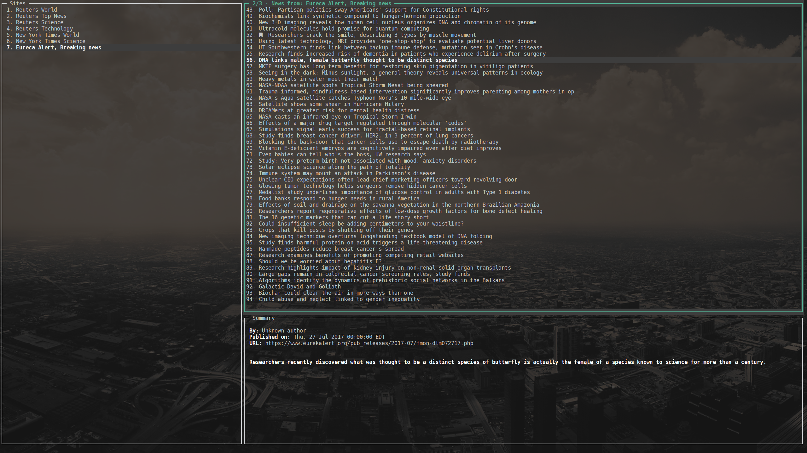

# terminews 

**terminews** is a terminal based application (TUI) which makes use of the [gocui](https://github.com/jroimartin/gocui) and [gofeed](https://github.com/mmcdole/gofeed) libraries and allows you to manage RSS resources and display their news feed. Currently it is only compatible with _Linux_ environments.

## Installation

**terminews** is currently available only on _Linux_.
### Dependencies

* [Sqlite3](https://www.sqlite.org/)
	For storing site' data and bookmarking news.

### From binary

   You may download and run the binary from the [latest release](https://github.com/antavelos/terminews/releases)

### From source code

    go get github.com/antavelos/terminews
	cd $GOPATH/src/github.com/antavelos/terminews
	go build
	./terminews

## Usage

### Layout
The terminal is split in 3 different areas:
1. **Sites list** which contains the list of the user's saved sites.
2. **News list** which contains the news feed (list of news' titles) of the currently selected site.
3. **Summary** which contains extra information of the currently selected event.

### Key bindings
 Key combination | Description
---|---
<kbd>Tab</kbd>|Focuses between the Sites list and the News list alternately
<kbd>Enter</kbd>|Retrieves the news feed of the currently selected site or submits user input
<kbd>Ctrl</kbd><kbd>o</kbd>|Downloads the content of the currently selected event. The current approcah is quite naive as it will display every single text found in a `
` tag within the text.
<kbd>Ctrl</kbd><kbd>Alt</kbd><kbd>o</kbd>|Opens the currently selected event using the default browser
<kbd>Ctrl</kbd><kbd>n</kbd>|Prompts the user to add a new site (URL)
<kbd>Ctrl</kbd><kbd>f</kbd>|Prompts the user to search among the existing sites. Multiple terms are allowed and they are used conjunctively
<kbd>Ctrl</kbd><kbd>q</kbd>|Closes any window (input prompt, event content) displayed on top of the main windows
<kbd>Ctrl</kbd><kbd>b</kbd>|Adds or removes the currently selected event in the bookmarks list
<kbd>Ctrl</kbd><kbd>Alt</kbd><kbd>b</kbd>|Displays the bookmarked events
<kbd>Del</kbd>|Deletes the selected site of the selected bookmarked event depending on which list is currently focused
<kbd>&uarr;</kbd>|Moves to the previous list item circularly
<kbd>&darr;</kbd>|Moves to the next list item circularly
<kbd>PgUp</kbd>|Moves to the previous list page circularly
<kbd>PgDn</kbd>|Moves to the next list page circularly
<kbd>Ctrl</kbd><kbd>c</kbd>|Exits the application

## TODO
- [x] Add search functionality among the existing sites.
- [x] Display full news content.
- [ ] Add tags to bookmarks
- [ ] Apply caching

## Credits
* [GOCUI](https://github.com/jroimartin/gocui) for the UI
* [gofeed](https://github.com/mmcdole/gofeed) for retrieving the RSS feed
* [GoOse](https://github.com/advancedlogic/GoOse) for extracting article content
